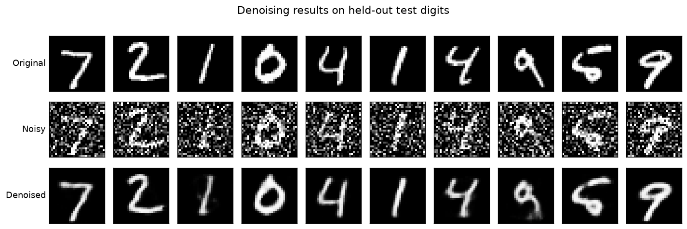

# Autoencoder for Image Denoising — MNIST

**Celebal Technologies Internship · Week 6 · Project 1**

Build a deep-learning model that removes noise from images using an **autoencoder** trained on MNIST.

The complete project lives in a single, fully-executed Jupyter notebook:
**[`DenoisingAutoencoder.ipynb`](./DenoisingAutoencoder.ipynb)** (all outputs, plots and metrics are already baked in — open it and read top to bottom, no need to re-run).

---

## TL;DR — Results

A convolutional denoising autoencoder (PyTorch) trained on noisy → clean MNIST pairs.
Evaluated on the held-out 10,000-image test set with Gaussian noise (factor 0.5):

| Metric | Noisy input | **Denoised output** | Improvement |
|--------|:-----------:|:-------------------:|:-----------:|
| MSE  | 0.1157 | **0.0109** | 90.5 % lower |
| PSNR | 9.38 dB | **19.98 dB** | **+10.60 dB** |
| SSIM | 0.375 | **0.861** | **+0.486** |

The denoiser also **generalizes to unseen salt-and-pepper noise** (SSIM 0.50 → 0.90) and **beats classical filters** (autoencoder SSIM **0.853** vs. median filter 0.487, Gaussian blur 0.371).



---

## What's inside

| Path | Description |
|------|-------------|
| `DenoisingAutoencoder.ipynb` | Main deliverable — end-to-end notebook with narrative, code, plots & analysis (executed). |
| `DenoisingAutoencoder.html` | Static HTML render of the executed notebook (view without Jupyter). |
| `figures/` | The 9 result figures (also embedded in the notebook). |
| `models/denoising_autoencoder.pth` | Trained model weights (reload without retraining). |
| `models/training_history.json` | Config, per-epoch losses, and final test metrics. |
| `requirements.txt` | Exact dependency versions. |
| `data/` | MNIST (auto-downloaded on first run; git-ignored). |

---

## Approach

1. **Data** — MNIST via `torchvision`, scaled to `[0, 1]`. 54k train / 6k validation / 10k test.
2. **Noise injection** — each clean image is corrupted on the fly with Gaussian noise
   `x̃ = clip(x + 0.5·ε, 0, 1)`, `ε ~ N(0, 1)`. Training pairs are **(noisy input → clean target)**.
3. **Model** — a symmetric **convolutional autoencoder**: encoder compresses `1×28×28` to a
   **128-D latent code**; decoder (transpose convolutions + sigmoid) rebuilds `1×28×28`. ~840k params.
4. **Training** — MSE loss, Adam (lr 1e-3), 20 epochs, with validation monitoring (no over-fitting).
5. **Evaluation** — qualitative grids **and** quantitative MSE / PSNR / SSIM on the full test set.

### Going further (beyond the reference)

The reference repo ([NvsYashwanth/MNIST-Autoecncoder](https://github.com/NvsYashwanth/MNIST-Autoecncoder))
builds autoencoders for image **reconstruction**. This project reuses that convolutional backbone but
extends it into a full **denoising** study with four additional analyses:

- **Robustness** — PSNR/SSIM measured across noise factors 0.1 → 1.0 (not just the training level).
- **Generalization** — denoising **salt-and-pepper** noise the model never saw in training.
- **Baseline comparison** — autoencoder vs. classical median / Gaussian filters.
- **Latent-space analysis** — t-SNE of the 128-D codes shows clean clustering by digit (unsupervised).

---

## How to run it yourself

```bash
# 1. Create an isolated environment (kept inside this folder)
python3 -m venv .venv
.venv/bin/python -m pip install -r requirements.txt

# 2. (optional) register the kernel used by the notebook
.venv/bin/python -m ipykernel install --sys-prefix \
    --name week6-denoise --display-name "Python (week6-denoise)"

# 3. Launch Jupyter and open DenoisingAutoencoder.ipynb
.venv/bin/jupyter lab            # or: .venv/bin/jupyter notebook

# --- or re-execute headlessly from the terminal ---
.venv/bin/jupyter nbconvert --to notebook --execute --inplace \
    --ExecutePreprocessor.kernel_name=week6-denoise \
    DenoisingAutoencoder.ipynb
```

MNIST downloads automatically on first run. Training takes ~2 minutes on an Apple-Silicon GPU (MPS);
the notebook auto-selects MPS → CUDA → CPU.

---

## Dataset & references

- **MNIST** handwritten digits — https://www.kaggle.com/datasets/awsaf49/mnist-dataset
  (loaded here via `torchvision.datasets.MNIST`, identical data).
- **Reference implementation** — https://github.com/NvsYashwanth/MNIST-Autoecncoder
