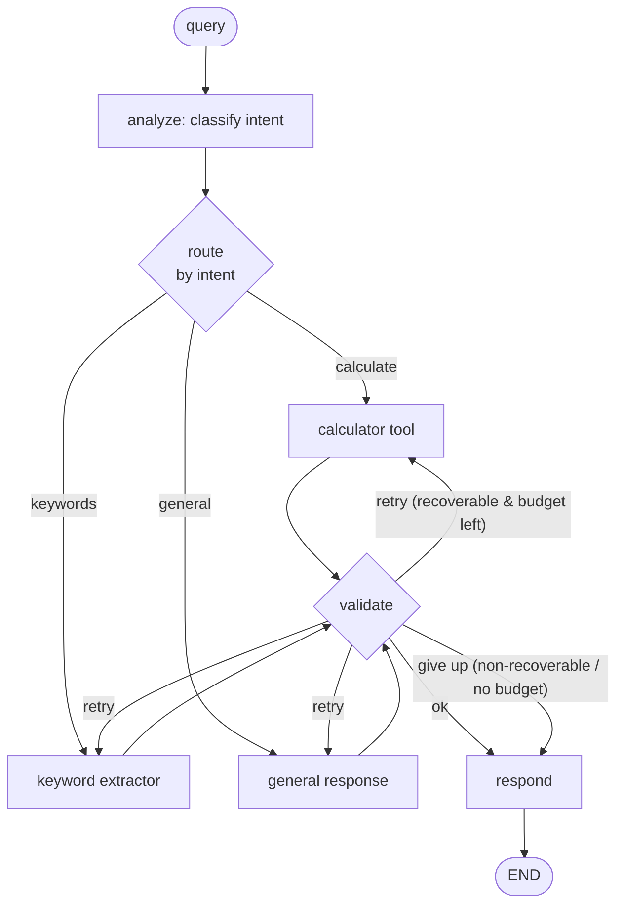

# Architecture

A single agent, built as a **stateful directed graph**, that classifies each
query and routes it to one of three tools — with a retry loop, schema-validated
tool I/O, full trajectory logging, and aggregate metrics. Pure standard-library
Python, no LLM, fully deterministic.

## The graph



ASCII view of the same thing:

```
              ┌─────────┐     ┌───────┐
   query ───▶ │ analyze │ ──▶ │ route │ ──(conditional by intent)──┐
              └─────────┘     └───────┘                            │
                                  ┌───────────────┬────────────────┤
                                  ▼               ▼                ▼
                            ┌──────────┐   ┌─────────────┐   ┌──────────┐
                            │calculator│   │  keywords   │   │ general  │
                            └────┬─────┘   └──────┬──────┘   └────┬─────┘
                                 └────────────────┼───────────────┘
                                                  ▼
                                            ┌──────────┐   retry (recoverable
                                            │ validate │◀──── & budget left):
                                            └────┬─────┘     loop back to the
                                       ok /      │  \ give up   tool node
                                          ▼      ▼   ▼
                                            ┌──────────┐
                                            │ respond  │ ──▶ END
                                            └──────────┘
```

The **cycle** is `validate → (tool) → validate`: a recoverable failure with
retry budget left loops back to the specialist that just ran. That back-edge is
what makes this a graph rather than a line.

## Modules

| File | Responsibility |
|------|----------------|
| `state.py` | `AgentState` — the shared, mutable memory passed to every node |
| `graph.py` | `StateGraph` — nodes, static & conditional edges, cycles, the runner, infinite-loop guard |
| `router.py` | Rule-based intent classification + intent→node mapping |
| `tools.py` | `Tool` base + Calculator / KeywordExtractor / GeneralResponse + `FlakyTool` |
| `schemas.py` | Dependency-free JSON-Schema validator |
| `nodes.py` | The role nodes (analyze/route/tool/validate/respond) and edge routers |
| `pipeline.py` | `build_graph` wiring + `Pipeline`/`RunResult` façade |
| `trajectory.py` | Step logging + trajectory evaluation |
| `metrics.py` | `MetricsCollector` — completion rate, cost, etc. |
| `parallel.py` | Sequential vs concurrent tool execution helpers |

## How each quiz concept maps to the code

| # | Concept | Where it lives |
|---|---------|----------------|
| Q1 | Stateful directed graph vs linear pipeline | `graph.py` (engine) + `state.py` (`AgentState` shared across nodes) |
| Q2 | Nodes & edges | `StateGraph.add_node` / `add_edge` / `add_conditional_edges`; nodes in `nodes.py` |
| Q3 | Conditional routing for 3 query types | `router.classify` + `route_by_intent` + the `route` conditional edge |
| Q4 | Cycles / retry loop | `validate → tool` back-edge via `validate_router`; guard in `graph.py` |
| Q5 | One agent simulating multi-agent | Distinct role nodes (analyst → dispatcher → specialist → reviewer → writer) |
| Q6 | JSON-schema tools | `schemas.py` validator + every `Tool.input_schema`/`output_schema` |
| Q7 | Sequential vs parallel tool calls | `parallel.py` (`run_sequential` / `run_parallel` / `compare`) |
| Q8 | Error handling | try/except in tool nodes + recoverable/non-recoverable retry + engine backstop |
| Q9 | Trajectory evaluation | `trajectory.py` (`Trajectory`, `evaluate_trajectory`) |
| Q10 | Task completion rate & cost | `metrics.py` (`MetricsCollector`) + per-attempt cost in `nodes.py` |

## Design decisions

- **Recoverable vs non-recoverable errors.** A `ToolError` carries a
  `recoverable` flag. Transient faults (simulated by `FlakyTool`) are
  recoverable and trigger the retry loop; malformed input and division by zero
  are non-recoverable, so the loop gives up immediately instead of burning
  retries on something that can't succeed. This keeps cost down (Q10) while
  staying robust (Q8).
- **Cost = tool calls, charged per attempt.** Every call — including failed
  ones — is charged, so a retried run visibly costs more. That makes "reduce
  unnecessary tool calls" a measurable lever rather than a slogan.
- **Determinism.** No model and no randomness means the same query always
  produces the same route, answer, and trajectory — which is exactly what makes
  the behaviour unit-testable.
- **The LLM seam is obvious.** `GeneralResponseTool.run` and `router.classify`
  are the two places a real model would slot in; everything around them
  (routing, retries, schemas, trajectory, metrics) is model-agnostic.
